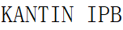
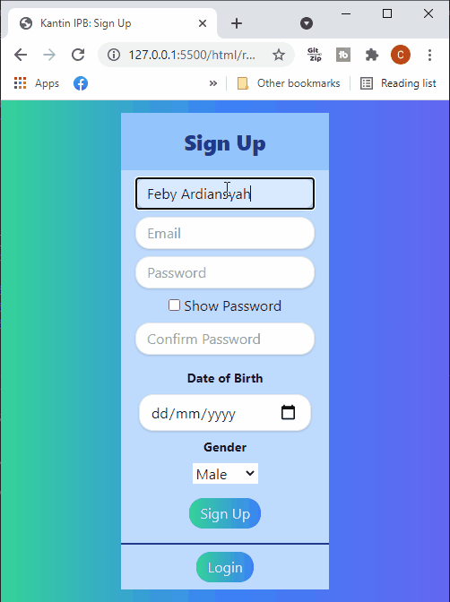

<h1 align = "center">PSBO</h1>
<h2 align = "center">Projek Akhir Pengantar Sistem Berorientasi Objek</h2>

<h1 align="center"></h1>

[Navigation](#)

[Deskripsi Singkat Aplikasi](#deskripsi) | [User Analysis](#user) | [Spesifikasi teknis lingkungan pengembangan](#spec) | [Fitur umum](#fitur) | [OOP](#oop) | [Tipe desain pengembangan yang digunakan](#design) | [Developer beserta job desc](#job) | [Progress](#progress) | [Referensi](#referensi)

# Deskripsi Singkat Aplikasi

Kantin IPB adalah aplikasi berbasis web untuk menemukan makanan bergizi termurah, terdekat, di sekitar kampus IPB Dramaga.

## Pendahuluan
Kebutuhan akan makan dan minum adalah kebutuhan pokok manusia. Memperoleh makanan dan minuman yang baik dan bergizi sudah seharusnya merupakan hal yang mudah. Namun, beberapa hal yang terjadi saat ini banyak yang mengalami kesulitan untuk memperoleh makanan dan minuman yang bergizi, tak terkecuali mahasiswa atau civitas IPB. Seringkali mahasiswa kesulitan mencari tempat makan di kawasan kampus IPB Dramaga yang luas. Kasus lainnya pun kerap kali terjadi pula ketika mahasiswa yang harus pulang dari kantin IPB dengan tangan hampa karena tidak mengetahui jam operasi kantin tersebut sehingga kerap datang ke kantin diwaktu yang kurang tepat. Beberapa pelanggan yang memperdulikan kebutuhan akan makanan yang bergizi, kesulitan dalam mencarinya karena tidak tahu kantin mana yang menyediakan makanan atau minuman dengan gizi yang ia butuhkan. Selain itu, adapun pelanggan yang tidak bisa membeli makanan dan minuman yang harganya tidak sesuai dengan uang di tangan. Layanan kantin IPB kami bertujuan untuk menangani masalah-masalah tersebut dengan mendigitalisasi informasi, sebagai sebuah layanan sistem informasi yang dapat memudahkan civitas IPB dalam menemukan informasi yang ia inginkan seputar kantin IPB Dramaga.

# User Analysis
[`^ kembali ke atas ^`](#)

Aplikasi Kantin IPB mempunyai dua jenis pengguna. Pengguna pertama dan utama adalah mahasiswa IPB yang dapat melihat informasi seputar kantin di IPB. Pengguna kedua adalah pedagang kantin yang menjual makanan dan minuman serta mengelola kantin di IPB. Pengguna kedua ini dapat membuat profil dan memasukkan menu yang dijual oleh pengguna kedua. Lebih lengkapnya dapat dilihat di use case Kantin IPB berikut.

## User Stories
Sebagai mahasiswa IPB, saya  ingin mengetahui harga menu makanan di setiap kantin IPB beserta informasi nilai gizi dari makanan tersebut, sehingga saya dapat mengonsumsi makanan dengan nutrisi yang baik dan harga terjangkau.

Sebagai mahasiswa baru IPB Dramaga, saya ingin mengetahui waktu beroperasi dan letak tempat-tempat makan di IPB, sehingga saya tidak perlu tersesat dan membuang banyak waktu untuk mencari tempat makan.

Sebagai pemilik rumah makan di IPB, saya ingin mempromosikan dan membuat lebih banyak orang mengetahui tentang rumah makan saya, sehingga lebih banyak pelanggan yang dapat menemukan dan datang ke rumah makan saya.

Sebagai pemilik rumah makan di IPB, saya ingin mengetahui daftar menu dan harga makanan dan minuman yang dijual pesaing-pesaing saya yakni pemilik rumah makan lain di IPB, sehingga saya dapat menentukan harga yang kompetitif untuk makanan dan minuman yang saya jual dan mampu bersaing dengan pemilik rumah makan lain.

# Spesifikasi teknis lingkungan pengembangan
[`^ kembali ke atas ^`](#)

### Software
* Text Editor : Visual Studio Code  
* Operating System : Windows 10 Home 64-bit  
* Design Tools and Prototyping : Figma  
* Management Tools : Github dan Google Meet  

### Hardware
* CPU : AMD Dual Core A9-9420, 3.6 GHz  
* GPU : Radeon R5 M420 2GB
* RAM : 4GB DDR
* ROM : 512Gb HDD dan 128Gb SSD

### Tech Stack
* HTML5, CSS3, Javascript : (Languanges)  
* TailwindCSS : (CSS Framework)
* Express.js : (Node.js Framework)
* MongoDB : (Database)  

# Fitur umum
[`^ kembali ke atas ^`](#)

Kantin IPB adalah aplikasi berbasis web yang memiliki fitur pencarian untuk menemukan makanan yang berada di seputar kampus IPB Dramaga. Fitur pencarian tersebut meliputi menu, harga, lokasi dan jam operasional dari seluruh kantin di IPB hingga nutrisi dari menu yang disajikan. 

Selain fitur search, Kantin IPB juga menyediakan fitur sort. Search digunakan ketika pengguna ingin mencari makanan berdasarkan keyword tertentu. Sort digunakan ketika pengguna ingin mengurutkan makanan dengan memilih kategori tertentu seperti harga atau nutrisi.

Aplikasi Kantin IPB membutuhkan data yang lengkap dan akurat untuk menjalankan aplikasi sesuai dengan fungsinya. Aplikasi ini sangat bergantung pada pengguna kedua karena pengguna tersebut yang memberikan data seputar kantin mulai dari menu yang disajikan sampai nutrisi yang ada pada makanan. Data nutrisi dari makanan kami dapatkan dari web lain yang menyediakan informasi nutrisi dari makanan umum yang dikonsumsi oleh masyarakat Indonesia. Pengguna kedua cukup memilih kategori dari makanan yang dijual dan sistem akan secara otomatis menampilkan nutrisi dari makanan tersebut.

## Dampak 
[`^ kembali ke atas ^`](#)

Dengan adanya aplikasi Kantin IPB, kami mengharapkan agar pengguna dapat mengakses informasi seputar kantin IPB dengan mudah dan cepat. Pengguna dapat menemukan menu makanan dengan pola yang sesuai dengan tubuh atau sesuai dengan budget. Dengan begitu, tidak ada lagi pengguna yang kelaparan karena tidak mengetahui makanan yang sesuai dengan budget mereka.

Sebagai pedagang atau pemilik toko, Anda dari manapun bisa melihat dan mengupdate profil toko Anda.

Anda bisa dengan seketika mengetahui posisi kantin IPB yang ada di sekitar kampus IPB Dramaga saat itu juga (real time) dimanapun Anda berada.

Semua informasi kantin yang Anda inginkan langsung tersusun secara real time di dalam layanan Kantin IPB.

Meningkatkan kualitas manajemen toko Anda dan menyajikan informasi up-to-date untuk pengguna sehingga mengundang lebih banyak pelanggan untuk menemukan dan datang ke toko Anda, yang berarti lebih banyak penjualan dan lebih besar keuntungan yang bisa Anda peroleh.

# Konsep OOP yang digunakan
[`^ kembali ke atas ^`](#)

* Encapsulation adalah konsep OOP berupa pembungkusan class untuk menjaga apa apa saja yang ada di dalam class tersebut, baik method ataupun atribut, untuk membatasi hak akses oleh class lainnya. Hal itu dilakukan oleh melalui Hak Akses Modifier yang terdiri dari : Public, Private, dan Protected.

* Inheritance adalah konsep OOP dimana sebuah class dapat mewariskan property dan method yang dimilikinya kepada class lain. Konsep inheritance dipakai untuk memanfaatkan fitur code reuse, yakni menghindari terjadinya redundanci dan pengulangan kode program.

* Abstraction adalah proses untuk menyembunyikan detail implementasi program dari user sehingga hanya detail yang diinginkan saja yang ditampilkan kepada user, atau dengan kata lain user akan menerima informasi mengenai apa yang dapat dilakukan oleh suatu objek namun user tidak akan mengetahui bagaimana objek itu melakukannya.

* Polymorphism adalah konsep OOP di mana class memiliki banyak “bentuk” method yang berbeda, meskipun namanya sama.

# Tipe desain pengembangan yang digunakan
[`^ kembali ke atas ^`](#)

Design pattern adalah suatu metode untuk menyelesaikan permasalahan yang biasannya berulang atau memiliki pola dalam pengembangan suatu software. Design Pattern bukanlah sebuah metode yang langsung dapat mengubah penyelesaian masalah menjadi kode program melainkan sebuah pola dasar atau template dari cara untuk menyelesaikan suatu masalah dalam situasi berbeda. Design Pattern membantu mempercepat pengenmbangan suatu software karena pola-pola yang dijelaskan merupakan paradigma-paradigma yang telah teruji kegunaannya.  

Macam-macam Design Pattern Terdapat 3 pola bagian utama sesuai dengan kegunaannya. Berikut merupakan pola tersebut:   

* Creational Pattern (Pola Pembuatan) Pola ini merupakan suatu solusi untuk menyelesaikan permasalahan yang ditemui dalam suatu kejadian pembuatan suatu instance atau object.  
* Behavioral Pattern (Pola Perilaku) Pola ini merupakan suatu solusi untuk menyelasaikan permasalahan yang ditemui dalam komunikasi antar object-object.  
* Structural Pattern (Pola Struktural) Pola ini merupakan suatu solusi untuk menyelesaikan permasalahan yang ditemui dalam pengaturan komposisi class dan object.  

Dalam merancang dan mengembangkan Kantin IPB, kelompok kami menggunakan design pattern MVC (Model, View, Controllers) dimana sistem pengembangan tersebut terdiri dari tiga bagian, yaitu: Model (database), View (tampilan antarmuka), dan Controllers (interaksi model dan view).  

# Hasil dan Pembahasan
[`^ kembali ke atas ^`](#)

### Use case diagram  

### Activity diagram

#### Penjual

#### Diary

#### Report

#### Restaurant

### Class diagram   

### Entity Relationship Diagram 

### Arsitektur sistem  
 
### Fungsi utama yang dikembangkan   
Kantin IPB adalah aplikasi berbasis web yang berfungsi untuk melakukan pencarian makanan dari berbagai kantin yang ada di IPB University Dramaga secara online. Kantin IPB memiliki fitur untuk melihat kantin, melihat menu kantin, mencari menu makanan, menambah menu makanan, mengedit menu makanan, menghapus menu makanan, menambah artikel baru, mengedit artikel, menghapus artikel, mentracking asupan makanan dan minuman user per hari, dan melihat report asupan kalori per satuan waktu. 

* Melihat menu makanan dan minuman yang tersedia di kantin IPB Dramaga; Pada fitur ini, user dapat melihat berbagai menu makanan yang tersedia di kantin IPB Dramaga. Setiap menu memiliki beberapa nilai, seperti nama menu, harga, kalori, dan rating. 
* Membaca, menulis, mengedit, dan menghapus artikel; User dapat menggunakan fitur artikel yang diinginkan. 
* Melakukan tracking asupan nutrisi harian; User dapat melakukan tracking harian dan melihat asupan kalori yang ia konsumsi per satuan waktu dalam bentuk grafik visual.

### Fungsi CRUD   
* Create; Implementasi fungsi create pada aplikasi web Kantin IPB terdapat pada fitur daftar akun, tambah diary makanan hari ini, fitur tambah menu makanan, dan fitur buat artikel baru.  
* Read; Implementasi fungsi read pada aplikasi web Kantin IPB terdapat pada fitur login dan daftar akun yaitu pada saat pemasukkan password dan data serta authentikasi, fitur diary asupan makanan hari ini, fitur report, fitur search, fitur lihat daftar menu makanan, dan fitur lihat daftar artikel.   
* Update; Implementasi fungsi update pada aplikasi web Kantin IPB yaitu terdapat pada fitur edit menu makanan, edit diary asupan makanan hari ini, edit artikel, dan ubah password pada menu "forgot password".   
* Delete; Implementasi fungsi delete pada aplikasi web Kantin IPB yaitu terdapat pada fitur hapus menu makanan, hapus artikel, dan hapus diary asupan makanan hari ini.

## Screenshot sistem
[`^ kembali ke atas ^`](#)

### Register:

### Login:

### Menus:

### Restaurants:

### Contoh Kantin - Red Corner:

### Add New Food:

### Diary:

### Report:

### Article:

### Create New Article:

### Link aplikasi (jika sudah di deploy)   
TDA

# Saran untuk pengembangan selanjutnya   
[`^ kembali ke atas ^`](#)

Untuk pengembangan selanjutnya, diharapkan sistem telah terintegrasi dengan baik ke database dan backend. Selain itu, diharapkan tampilan sistem juga dapat ditingkatkan dan disesuaikan dengan user untuk memberikan User Experience yang lebih baik. Serta penambahan fitur untuk memberikan review/komentar pada menu makanan/kantin oleh user, dan fitur pesan makanan untuk diantar ke asrama/lokasi yang user inginkan di kawasan kampus IPB Dramaga.

# Developer beserta job desc
[`^ kembali ke atas ^`](#)

* Feby Ardiansyah - G64180059 - Front End
* Muhammad Faris Waliyuddin - G64180067 - Back End
* Muhammad Rifqi Hizrian Afri - G64180073 - Back End
* Zidane Ibrahim Fadela - G64180015 - UI/UX Designer

## Referensi
[`^ kembali ke atas ^`](#)

* <a href="https://www.figma.com/file/LJXWTzxReLjmdCkKyL44dT/PSBOOOOOOOO?node-id=0%3A1">Figma — App Design</a>
* [Ide aplikasi](idea.md) — Ide dasar aplikasi.
* <a href="https://docs.google.com/presentation/d/1El7FcqeqvpHcNL6eSirFupjdtnEE3ECGp1EsXfeUBBc/edit?usp=sharing"> Powerpoint Aplikasi Web Kantin IPB
* [Status Report 1](status_1.md) — Status Report (24-04-2021).
* [Status Report 2](status_2.md) — Status Report (01-05-2021).
* <a href="/Frontend/doc/TOC.md">Frontend: Dokummentasi</a> — Table of Content of Frontend Docs
